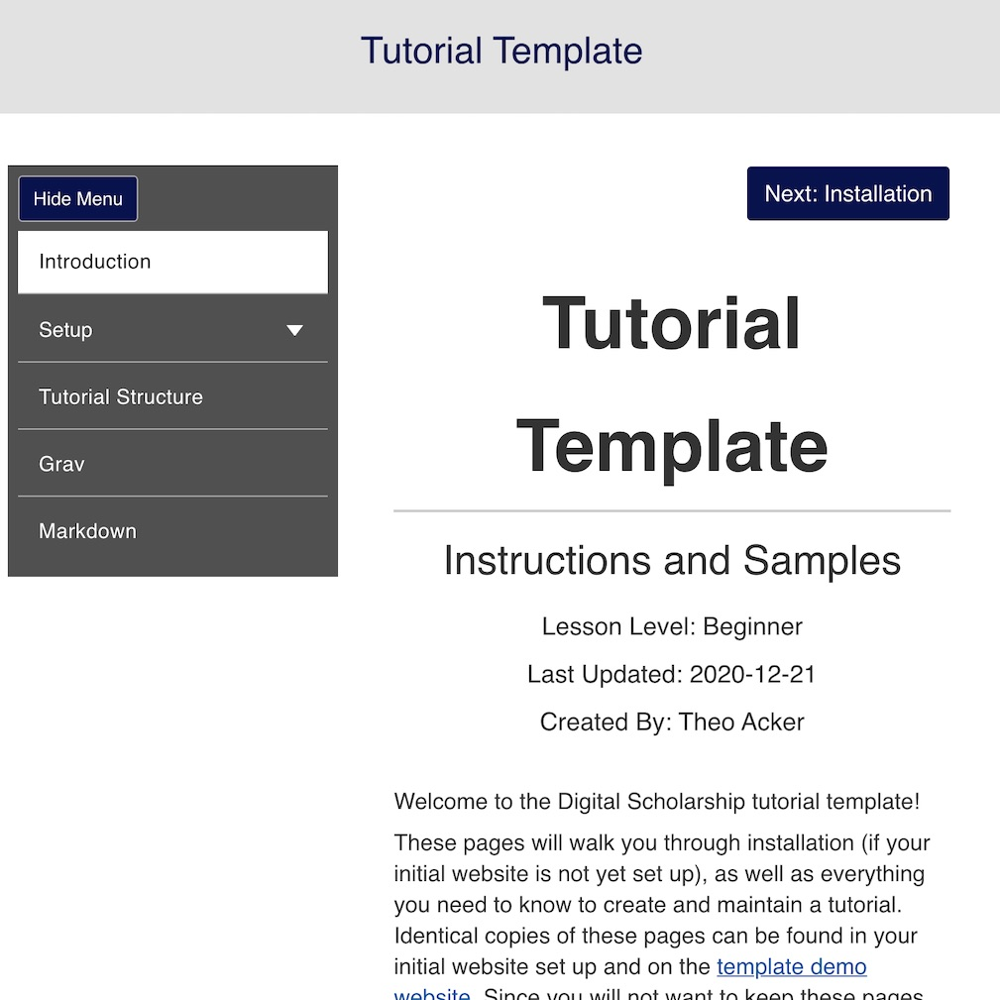

# Tutorial Theme



**Tutorial** is a Grav theme designed for creating accessible tutorials. Check out the [demo website](https://www.ds-tutorials.oucreate.com/grav-tutorial-demo) to see how it looks in action.

## Requirements

Tutorial extends the [Learn2](https://github.com/getgrav/grav-theme-learn2) theme. You will need to install both themes before you can use the Tutorial theme. You should also have [Grav](https://github.com/getgrav/grav) version 1.6.0 or greater.

Learn2 requires the [Error](https://github.com/getgrav/grav-plugin-error) and [Problems](https://github.com/getgrav/grav-plugin-problems) plugins.

## Installation

Installing the Tutorial theme can be done in one of two ways. The GPM (Grav Package Manager) installation method enables you to quickly and easily install the theme with a simple terminal command, while the manual method enables you to do so via a zip file.

If you are using the Admin plugin then you will not have to use a terminal command to install the theme with the GPM. Detailed instructions for working with the theme can be found on the demo website.

### GPM Installation (Preferred)

The simplest way to install this theme is via the [Grav Package Manager (GPM)](https://learn.getgrav.org/cli-console/grav-cli-gpm) through your system's Terminal (also called the command line). From the root of your Grav install type:

```
bin/gpm install tutorial
```

This will install the Tutorial theme into your `/user/themes` directory within Grav. Its files can be found under `/your-site/grav/user/themes/tutorial`.

### Manual Installation

To install this theme, download the zip version of this repository and unzip it under `/your-site/grav/user/themes`. Then, rename the folder to tutorial. You can find these files either on [GitHub](https://github.com/ds-tutorials/grav-theme-tutorial) or via [GetGrav.org](https://getgrav.org/downloads/themes).

You should now have all the theme files under

```
/your-site/grav/user/themes/tutorial
```

>> NOTE: Make sure you have the Learn2 theme and required plugins specified in the Requirements section above.

## Updating

As development for the Tutorial theme continues, new versions may become available that add additional features and functionality, improve compatibility with newer Grav releases, and generally provide a better user experience. As with installation, updating Tutorial can be done through Grav's GPM system (via terminal or the Admin panel) or manually.

### GPM Update (Preferred)

The simplest way to update this theme is via the Grav Package Manager (GPM). You can do this with this by navigating to the root directory of your Grav install using your system's Terminal (also called command line) and typing the following:

```
bin/gpm update tutorial
```

This command will check your Grav install to see if your Tutorial theme is due for an update. If a newer release is found, you will be asked whether or not you wish to update. To continue, type `y` and hit enter. The theme will automatically update and clear Grav's cache.

### Manual Update

To manually update Tutorial:

- Delete the `/your-site/user/themes/tutorial` directory.
- Download the new version of the Tutorial theme from either [GitHub](https://github.com/ds-tutorials/grav-theme-tutorial) or [GetGrav.org](https://getgrav.org/downloads/themes).
- Unzip the zip file in `your-site/user/themes` and rename the resulting folder to tutorial.
- Clear the Grav cache. The simplest way to do this is by going to the root Grav directory in terminal and typing `bin/grav clear-cache`.

>> NOTE: Note: Any changes you have made to any of the files listed under this directory will also be removed and replaced by the new set. Any files located elsewhere (for example a YAML settings file placed in `user/config/themes`) will remain intact.

## Setup

More extensive setup instructions and information can be found on the [demo website](https://www.ds-tutorials.oucreate.com/grav-tutorial-demo)

If you want to set Tutorial as the default theme and are using the Admin plugin, you can do so by going to **Themes**, finding Tutorial, and clicking **Activate**. Otherwise, follow these steps:

- Navigate to `/your-site/grav/user/config`.
- Open the **system.yaml** file.
- Change the `theme:` setting to `theme: tutorial`.
- Save your changes.
- Clear the Grav cache. The simplest way to do this is by going to the root Grav directory in Terminal and typing `bin/grav clear-cache`.

Once this is done, you should be able to see the new theme on the frontend. Keep in mind any customizations made to the previous theme will not be reflected as all of the theme and templating information is now being pulled from the tutorial folder.

### Default Options

The following default options are provided:

```yaml
enabled: true               # Enable the theme
git_link:                   # Link to a GitHub repository syncing with the site's pages folder
favicon:                    # Custom favicon to use instead of the default Grav favicon
custom_logo:                # Custom logo to use if desired
custom_logo_text:           # Optional, custom text if not using a logo image
home_url:                   # Will turn the logo into a link to this URL
logo_alt:                   # Alternative text if using a logo image
use_ga: true                # Accepts true or false, enables Google Analytics
ga_id:                      # Google Analytics id (should start with "G-")
ga_privacy: true            # Enables using the default included Google Analytics privacy statement in the footer, will only be used if Google Analytics is enabled and an id has been provided. Disable this if you are providing your own statement.
maintainer:                 # The site/tutorial maintainer
maintainer_url:             # Link to the site/tutorial maintainer's website
license:                    # License the website content will be shared under
license_url:                # Link to full license from above
license_img:                # Link to license image if desired
show_git_link: true         # Adds the git_link provided above to the site footer
git_service: GitHub         # The provided git link will read: "View on <git_service>"
```

The [Admin] plugin, which is recommended for use with this theme, will provide a useful interface for modifying any of these settings. Otherwise, you can copy the `user/themes/tutorial/tutorial.yaml` file to the `user/config/themes/` folder and modify it manually.

>> NOTE: NOTE: Do not modify the user/themes/tutorial/tutorial.yaml file directly or your changes will be lost with any updates

### Git Sync

The [Git Sync] plugin is highly recommended to keep track of your changes over time. Whether or not you use this plugin, you can store your content in a git repository and provide a link in the footer. The link text will read: "View on `git_service`" (default: View on GitHub).

### Google Analytics

Tutorial was designed for easy integration with Google Analytics (GA). If GA is enabled and an id has been provided, an opt-out button will be added to the site footer.

### License

License information provided will be added to the site footer. Recommended settings are as follows:

```yaml
license: Creative Commons Attribution-ShareAlike 4.0 International License  # License the website content will be shared under
license_url: https://creativecommons.org/licenses/by-sa/4.0/                # Link to full license from above
license_img: https://i.creativecommons.org/l/by-sa/4.0/88x31.png            # Link to license image if desired
```

## Features

### Accessibility

Tutorial is designed for digital accessibility, but does not guarantee that your site will be accessible or that it will comply with any accessibility requirements. You are responsible for creating accessible content and testing your website.

### Supported Page Templates

- Chapter
- Docs
- Folder
- Default

### Supported/Recommended Plugins

- Admin
- Error
- Form
- Git Sync
- Highlight
- Login
- Markdown Notices
- Problems
- Shortcode Core